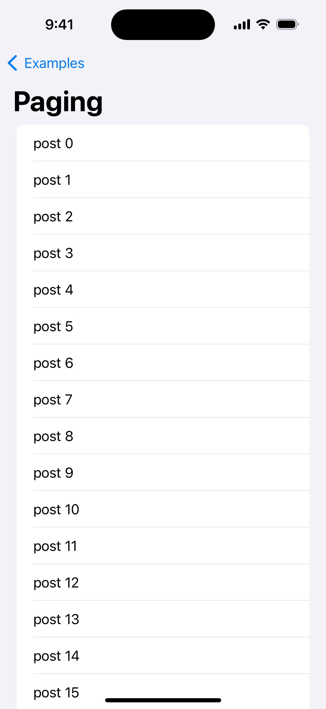

# swiftui-async-feedback

Unidirectional Reactive Architecture for SwiftUI. This is a Swift Concurrency implemetation of [RxFeedback](https://github.com/NoTests/RxFeedback.swift) and [CombineFeedback](https://github.com/sergdort/CombineFeedback).

| Swift Concurrency | No custom Views | easy Binding |
| - | - | - |
| Written in `AsyncStream` and support `Sendable`. | No custom Views, only use `@ViewContext` property. | `Feedback` can react the change via `Binding` that pass to SwiftUI components such as `TextField(text: Binding<String>)`. |

# Quick Overview

- Define your `System`.
    - `System` is just a namespace of (`State`, `Event`, `Reducer`, `[Feedback]`).

```swift
import AsyncFeedback

struct CounterScreenSystem: SystemProtocol {
    struct State {
        var count: Int = 1
        var message: String? = nil
    }

    enum Event {
        case setMessage(String?)
    }

    // Reducer is a pure function.
    // Reducer will be called when event is triggered.
    //
    // typealias Reducer = (inout State, Event) -> Void
    func reducer() -> Reducer {
        { state, event in
            switch event {
            case .setMessage(let message):
                state.message = message
            }
        }
    }

    // Feedback is a logic to create new Event.
    // Feedback will react state changes.
    func feedbacks() -> [Feedback<Self>] {
        [
            // if State.count is changed, Feedback will react it.
            Feedback(.onChanged(\.count)) { state in
                // if count is multiple of 3, set message.
                if state.count.isMultiple(of: 3) {
                    return .setMessage("multiple of 3!!")
                } else {
                    return .setMessage(nil)
                }
            }
        ]
    }
}
```

- just use `@ViewContext` and start feedback loop by `await _context.runFeedbackLoop()`.

```swift
import SwiftUI

struct CounterScreen: View {

    // ViewContext is a propertyWrapper to combine AsyncFeedbacks into SwiftUI.
    @ViewContext(state: CounterScreenSystem.State(), system: CounterScreenSystem())
    var context

    var body: some View {
        VStack {
            Text(context.count.description)
                .font(.largeTitle)

            // easy binding
            // when count will be changed via Binding, Feedback will react it.
            Stepper("", value: $context.count)
                .labelsHidden()

            Text(context.message ?? "")
                .foregroundStyle(.red)
                .font(.largeTitle)
                .frame(height: 30)
        }
        .task {
            // start Feedback loop.
            await _context.runFeedbackLoop()
        }
    }
}
```

# Examples

| [Counter](Example/Package/Sources/CounterExample/) | [Todo](Example/Package/Sources/TodoExample/) | [Paging](Example/Package/Sources/PagingListExample/) |
| - | - | - |
| | ||
